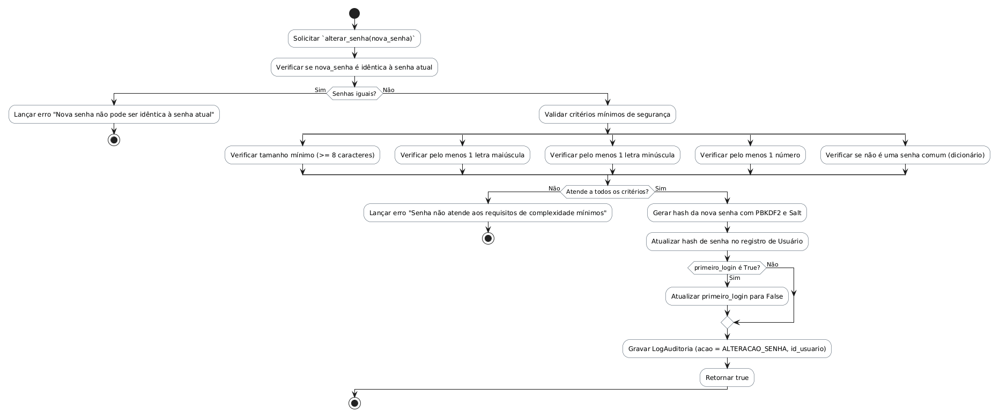

# Método `alterar_senha()`

Este documento apresenta a explicação e o diagrama de atividades para o método `alterar_senha()` da classe `Usuario`.

## Descrição
Altera a senha do usuário. Valida se a senha não é idêntica à atual, tem tamanho mínimo de 8 caracteres, possui letras maiúsculas, minúsculas, números e não é uma senha comum.

- **Classe:** `Usuario`
- **Requisitos Vinculados:** [RF002](file:///home/ian/Faculdade/APS/engenharia-de-requisitos/requisitos_SGDU.md#L93), [RF003](file:///home/ian/Faculdade/APS/engenharia-de-requisitos/requisitos_SGDU.md#L95), [RNF004](file:///home/ian/Faculdade/APS/engenharia-de-requisitos/requisitos_SGDU.md#L163)
- **Atores Relacionados:** Administrador, Moderador, Capitão

## Assinatura do Método
```python
alterar_senha(nova_senha: String) -> Boolean
```

## Regras de Negócio e Fluxo Lógico
O fluxo e as validações descritas a seguir representam o comportamento interno da operação:

1. Solicitar `alterar_senha(nova_senha)`
2. Verificar se nova_senha é idêntica à senha atual
3. Lançar erro "Nova senha não pode ser idêntica à senha atual"
4. Validar critérios mínimos de segurança
5. Verificar tamanho mínimo (>= 8 caracteres)
6. Verificar pelo menos 1 letra maiúscula
7. Verificar pelo menos 1 letra minúscula
8. Verificar pelo menos 1 número
9. Verificar se não é uma senha comum (dicionário)
10. Lançar erro "Senha não atende aos requisitos de complexidade mínimos"
11. Gerar hash da nova senha com PBKDF2 e Salt
12. Atualizar hash de senha no registro de Usuário
13. Atualizar primeiro_login para False
14. Gravar LogAuditoria (acao = ALTERACAO_SENHA, id_usuario)
15. Retornar true

## Diagrama de Atividades
O diagrama abaixo detalha visualmente o fluxo de decisões, desvios e ações executados pelo método. Ele foi modelado utilizando o formato PlantUML.



## Links Relacionados
- **Arquivo de Diagrama:** [alterar_senha.puml](alterar_senha.puml)
- **Documento Principal de Visão Lógica:** [Visão Lógica (visao_logica.md)](file:///home/ian/Faculdade/APS/engenharia-de-requisitos/docs/visao_logica/visao_logica.md)
