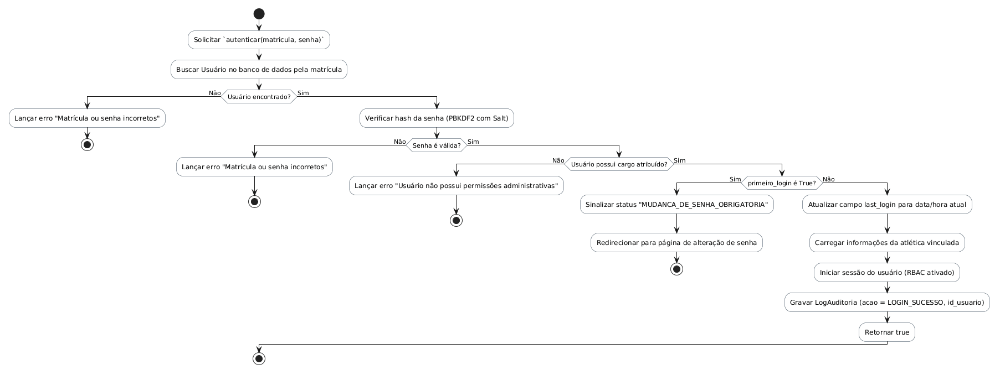

# Método `autenticar()`

Este documento apresenta a explicação e o diagrama de atividades para o método `autenticar()` da classe `Usuario`.

## Descrição
Realiza a autenticação de usuários administradores/moderadores/capitães usando matrícula e senha. Verifica o hash PBKDF2 e obriga a troca de senha no primeiro login.

- **Classe:** `Usuario`
- **Requisitos Vinculados:** [RF001](file:///home/ian/Faculdade/APS/engenharia-de-requisitos/requisitos_SGDU.md#L91), [RF002](file:///home/ian/Faculdade/APS/engenharia-de-requisitos/requisitos_SGDU.md#L93), [RNF004](file:///home/ian/Faculdade/APS/engenharia-de-requisitos/requisitos_SGDU.md#L163), [RNF005](file:///home/ian/Faculdade/APS/engenharia-de-requisitos/requisitos_SGDU.md#L165)
- **Atores Relacionados:** Administrador, Moderador, Capitão

## Assinatura do Método
```python
autenticar() -> Boolean
```

## Regras de Negócio e Fluxo Lógico
O fluxo e as validações descritas a seguir representam o comportamento interno da operação:

1. Solicitar `autenticar(matricula, senha)`
2. Buscar Usuário no banco de dados pela matrícula
3. Lançar erro "Matrícula ou senha incorretos"
4. Verificar hash da senha (PBKDF2 com Salt)
5. Lançar erro "Matrícula ou senha incorretos"
6. Lançar erro "Usuário não possui permissões administrativas"
7. Sinalizar status "MUDANCA_DE_SENHA_OBRIGATORIA"
8. Redirecionar para página de alteração de senha
9. Atualizar campo last_login para data/hora atual
10. Carregar informações da atlética vinculada
11. Iniciar sessão do usuário (RBAC ativado)
12. Gravar LogAuditoria (acao = LOGIN_SUCESSO, id_usuario)
13. Retornar true

## Diagrama de Atividades
O diagrama abaixo detalha visualmente o fluxo de decisões, desvios e ações executados pelo método. Ele foi modelado utilizando o formato PlantUML.



## Links Relacionados
- **Arquivo de Diagrama:** [autenticar.puml](autenticar.puml)
- **Documento Principal de Visão Lógica:** [Visão Lógica (visao_logica.md)](file:///home/ian/Faculdade/APS/engenharia-de-requisitos/docs/visao_logica/visao_logica.md)
