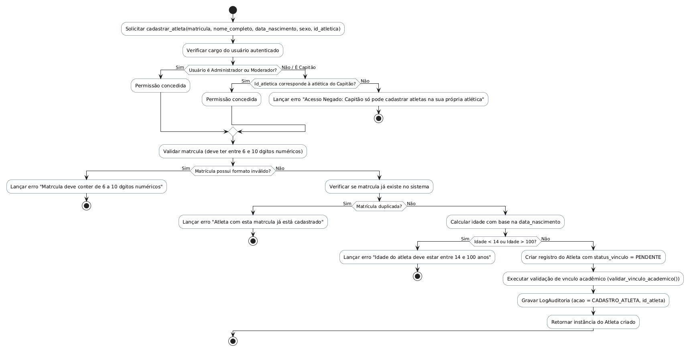

# Método `cadastrar_atleta()`

Este documento apresenta a explicação e o diagrama de atividades para o método `cadastrar_atleta()` da classe `Atleta`.

## Descrição
Cadastra um novo atleta. Valida formato e unicidade da matrícula, idade (14 a 100 anos), e permissões do cargo. Administrador/Moderador cadastra em qualquer atlética; Capitão apenas na sua própria.

- **Classe:** `Atleta`
- **Requisitos Vinculados:** [RF008](file:///home/ian/Faculdade/APS/engenharia-de-requisitos/requisitos_SGDU.md#L105), [RF028](file:///home/ian/Faculdade/APS/engenharia-de-requisitos/requisitos_SGDU.md#L145), [RNF005](file:///home/ian/Faculdade/APS/engenharia-de-requisitos/requisitos_SGDU.md#L165)
- **Atores Relacionados:** Administrador, Moderador, Capitão

## Assinatura do Método
```python
cadastrar_atleta() -> Atleta
```

## Regras de Negócio e Fluxo Lógico
O fluxo e as validações descritas a seguir representam o comportamento interno da operação:

1. Solicitar `cadastrar_atleta(matricula, nome_completo, data_nascimento, sexo, id_atletica)`
2. Verificar cargo do usuário autenticado
3. Permissão concedida
4. Permissão concedida
5. Lançar erro "Acesso Negado: Capitão só pode cadastrar atletas na sua própria atlética"
6. Validar matrícula (deve ter entre 6 e 10 dígitos numéricos)
7. Lançar erro "Matrícula deve conter de 6 a 10 dígitos numéricos"
8. Verificar se matrícula já existe no sistema
9. Lançar erro "Atleta com esta matrícula já está cadastrado"
10. Calcular idade com base na data_nascimento
11. Lançar erro "Idade do atleta deve estar entre 14 e 100 anos"
12. Criar registro do Atleta com status_vinculo = PENDENTE
13. Executar validação de vínculo acadêmico (validar_vinculo_academico())
14. Gravar LogAuditoria (acao = CADASTRO_ATLETA, id_atleta)
15. Retornar instância do Atleta criado

## Diagrama de Atividades
O diagrama abaixo detalha visualmente o fluxo de decisões, desvios e ações executados pelo método. Ele foi modelado utilizando o formato PlantUML.



## Links Relacionados
- **Arquivo de Diagrama:** [cadastrar_atleta.puml](cadastrar_atleta.puml)
- **Documento Principal de Visão Lógica:** [Visão Lógica (visao_logica.md)](file:///home/ian/Faculdade/APS/engenharia-de-requisitos/docs/visao_logica/visao_logica.md)
