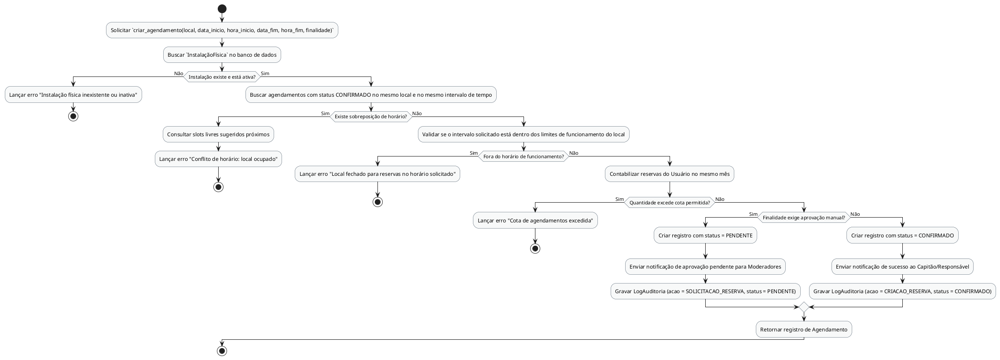

# Método `criar_agendamento()`

Este documento apresenta a explicação e o diagrama de atividades para o método `criar_agendamento()` da classe `Agendamento`.

## Descrição
Reserva uma instalação física para partidas ou treinos. Realiza a validação de disponibilidade e sobreposição de horários, limites de funcionamento, cota de uso mensal do usuário, e envia para aprovação se exigido.

- **Classe:** `Agendamento`
- **Requisitos Vinculados:** [RF023](file:///home/ian/Faculdade/APS/engenharia-de-requisitos/requisitos_SGDU.md#L135)
- **Atores Relacionados:** Administrador, Moderador, Capitão

## Assinatura do Método
```python
criar_agendamento() -> Agendamento
```

## Regras de Negócio e Fluxo Lógico
O fluxo e as validações descritas a seguir representam o comportamento interno da operação:

1. Solicitar `criar_agendamento(local, data_inicio, hora_inicio, data_fim, hora_fim, finalidade)`
2. Buscar `InstalaçãoFísica` no banco de dados
3. Lançar erro "Instalação física inexistente ou inativa"
4. Buscar agendamentos com status CONFIRMADO no mesmo local e no mesmo intervalo de tempo
5. Consultar slots livres sugeridos próximos
6. Lançar erro "Conflito de horário: local ocupado"
7. Validar se o intervalo solicitado está dentro dos limites de funcionamento do local
8. Lançar erro "Local fechado para reservas no horário solicitado"
9. Contabilizar reservas do Usuário no mesmo mês
10. Lançar erro "Cota de agendamentos excedida"
11. Criar registro com status = PENDENTE
12. Enviar notificação de aprovação pendente para Moderadores
13. Gravar LogAuditoria (acao = SOLICITACAO_RESERVA, status = PENDENTE)
14. Criar registro com status = CONFIRMADO
15. Enviar notificação de sucesso ao Capitão/Responsável
16. Gravar LogAuditoria (acao = CRIACAO_RESERVA, status = CONFIRMADO)
17. Retornar registro de Agendamento

## Diagrama de Atividades
O diagrama abaixo detalha visualmente o fluxo de decisões, desvios e ações executados pelo método. Ele foi modelado utilizando o formato PlantUML.



## Links Relacionados
- **Arquivo de Diagrama:** [criar_agendamento.puml](criar_agendamento.puml)
- **Documento Principal de Visão Lógica:** [Visão Lógica (visao_logica.md)](file:///home/ian/Faculdade/APS/engenharia-de-requisitos/docs/visao_logica/visao_logica.md)
