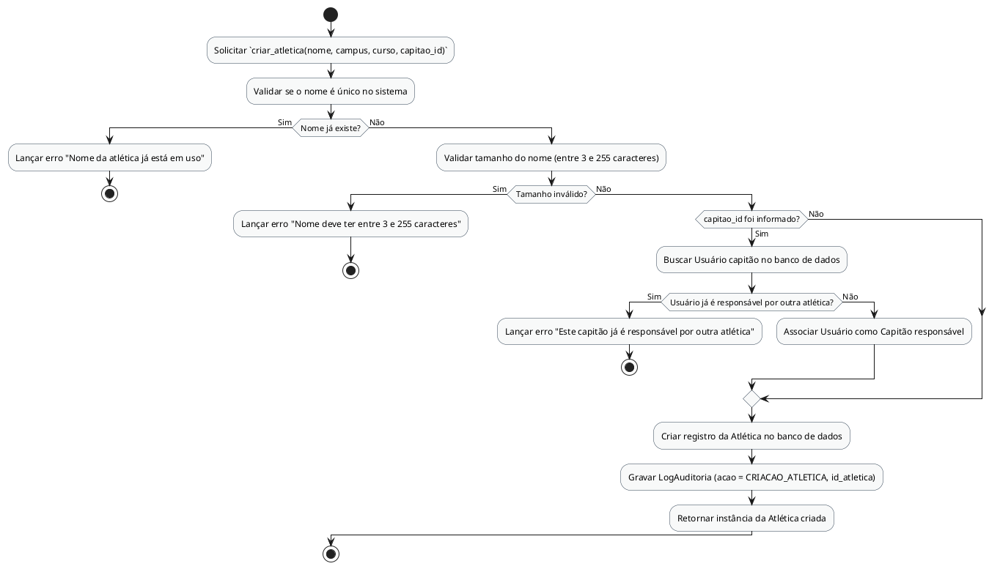

# Método `criar_atletica()`

Este documento apresenta a explicação e o diagrama de atividades para o método `criar_atletica()` da classe `Atlética`.

## Descrição
Responsável por cadastrar uma nova atlética no sistema, vinculando-a a um campus, curso e, opcionalmente, associando um Capitão como responsável (que não deve estar associado a nenhuma outra atlética).

- **Classe:** `Atlética`
- **Requisitos Vinculados:** [RF004](file:///home/ian/Faculdade/APS/engenharia-de-requisitos/requisitos_SGDU.md#L97)
- **Atores Relacionados:** Administrador, Moderador, Capitão

## Assinatura do Método
```python
criar_atletica() -> Atlética
```

## Regras de Negócio e Fluxo Lógico
O fluxo e as validações descritas a seguir representam o comportamento interno da operação:

1. Solicitar `criar_atletica(nome, campus, curso, capitao_id)`
2. Validar se o nome é único no sistema
3. Lançar erro "Nome da atlética já está em uso"
4. Validar tamanho do nome (entre 3 e 255 caracteres)
5. Lançar erro "Nome deve ter entre 3 e 255 caracteres"
6. Buscar Usuário capitão no banco de dados
7. Lançar erro "Este capitão já é responsável por outra atlética"
8. Associar Usuário como Capitão responsável
9. Criar registro da Atlética no banco de dados
10. Gravar LogAuditoria (acao = CRIACAO_ATLETICA, id_atletica)
11. Retornar instância da Atlética criada

## Diagrama de Atividades
O diagrama abaixo detalha visualmente o fluxo de decisões, desvios e ações executados pelo método. Ele foi modelado utilizando o formato PlantUML.



## Links Relacionados
- **Arquivo de Diagrama:** [criar_atletica.puml](criar_atletica.puml)
- **Documento Principal de Visão Lógica:** [Visão Lógica (visao_logica.md)](file:///home/ian/Faculdade/APS/engenharia-de-requisitos/docs/visao_logica/visao_logica.md)
