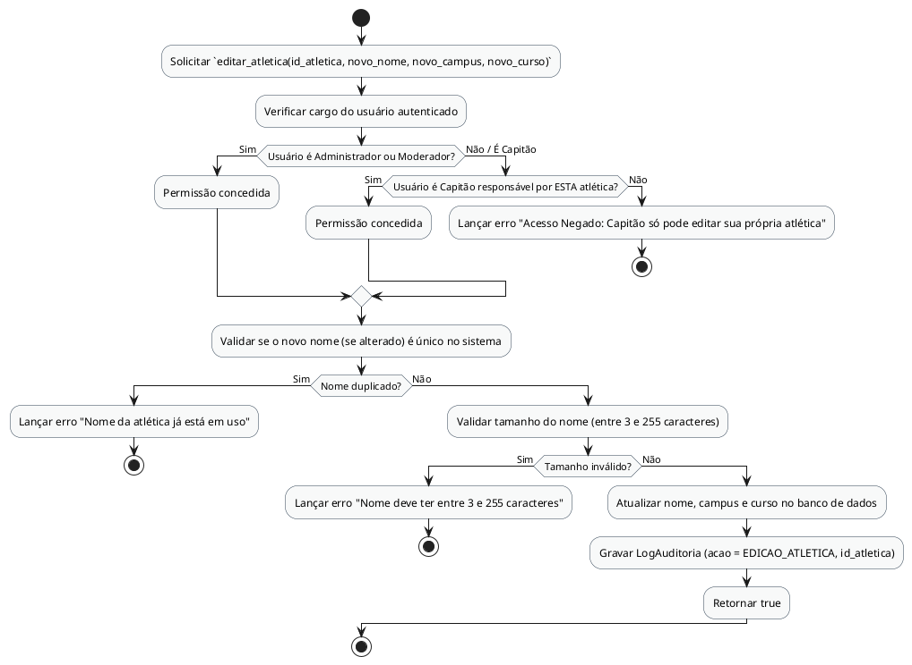

# Método `editar_atletica()`

Este documento apresenta a explicação e o diagrama de atividades para o método `editar_atletica()` da classe `Atlética`.

## Descrição
Permite editar o nome, campus e curso de uma atlética. Administradores e Moderadores podem editar qualquer atlética, enquanto o Capitão pode editar apenas a sua própria atlética.

- **Classe:** `Atlética`
- **Requisitos Vinculados:** [RF005](file:///home/ian/Faculdade/APS/engenharia-de-requisitos/requisitos_SGDU.md#L99), [RNF005](file:///home/ian/Faculdade/APS/engenharia-de-requisitos/requisitos_SGDU.md#L165)
- **Atores Relacionados:** Administrador, Moderador, Capitão

## Assinatura do Método
```python
editar_atletica() -> Boolean
```

## Regras de Negócio e Fluxo Lógico
O fluxo e as validações descritas a seguir representam o comportamento interno da operação:

1. Solicitar `editar_atletica(id_atletica, novo_nome, novo_campus, novo_curso)`
2. Verificar cargo do usuário autenticado
3. Permissão concedida
4. Permissão concedida
5. Lançar erro "Acesso Negado: Capitão só pode editar sua própria atlética"
6. Validar se o novo nome (se alterado) é único no sistema
7. Lançar erro "Nome da atlética já está em uso"
8. Validar tamanho do nome (entre 3 e 255 caracteres)
9. Lançar erro "Nome deve ter entre 3 e 255 caracteres"
10. Atualizar nome, campus e curso no banco de dados
11. Gravar LogAuditoria (acao = EDICAO_ATLETICA, id_atletica)
12. Retornar true

## Diagrama de Atividades
O diagrama abaixo detalha visualmente o fluxo de decisões, desvios e ações executados pelo método. Ele foi modelado utilizando o formato PlantUML.



## Links Relacionados
- **Arquivo de Diagrama:** [editar_atletica.puml](editar_atletica.puml)
- **Documento Principal de Visão Lógica:** [Visão Lógica (visao_logica.md)](file:///home/ian/Faculdade/APS/engenharia-de-requisitos/docs/visao_logica/visao_logica.md)
