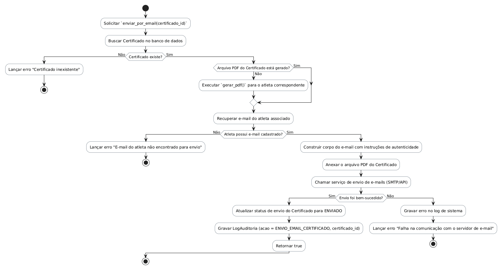

# Método `enviar_por_email()`

Este documento apresenta a explicação e o diagrama de atividades para o método `enviar_por_email()` da classe `Certificado`.

## Descrição
Envia o certificado gerado por e-mail para o atleta. Se o arquivo PDF correspondente ainda não tiver sido gerado, aciona a geração antes do envio.

- **Classe:** `Certificado`
- **Requisitos Vinculados:** [RF026](file:///home/ian/Faculdade/APS/engenharia-de-requisitos/requisitos_SGDU.md#L141), [RF027](file:///home/ian/Faculdade/APS/engenharia-de-requisitos/requisitos_SGDU.md#L143)
- **Atores Relacionados:** Administrador, Moderador, Capitão

## Assinatura do Método
```python
enviar_por_email()
```

## Regras de Negócio e Fluxo Lógico
O fluxo e as validações descritas a seguir representam o comportamento interno da operação:

1. Solicitar `enviar_por_email(certificado_id)`
2. Buscar Certificado no banco de dados
3. Lançar erro "Certificado inexistente"
4. Executar `gerar_pdf()` para o atleta correspondente
5. Recuperar e-mail do atleta associado
6. Lançar erro "E-mail do atleta não encontrado para envio"
7. Construir corpo do e-mail com instruções de autenticidade
8. Anexar o arquivo PDF do Certificado
9. Chamar serviço de envio de e-mails (SMTP/API)
10. Atualizar status de envio do Certificado para ENVIADO
11. Gravar LogAuditoria (acao = ENVIO_EMAIL_CERTIFICADO, certificado_id)
12. Retornar true
13. Gravar erro no log de sistema
14. Lançar erro "Falha na comunicação com o servidor de e-mail"

## Diagrama de Atividades
O diagrama abaixo detalha visualmente o fluxo de decisões, desvios e ações executados pelo método. Ele foi modelado utilizando o formato PlantUML.



## Links Relacionados
- **Arquivo de Diagrama:** [enviar_por_email.puml](enviar_por_email.puml)
- **Documento Principal de Visão Lógica:** [Visão Lógica (visao_logica.md)](file:///home/ian/Faculdade/APS/engenharia-de-requisitos/docs/visao_logica/visao_logica.md)
