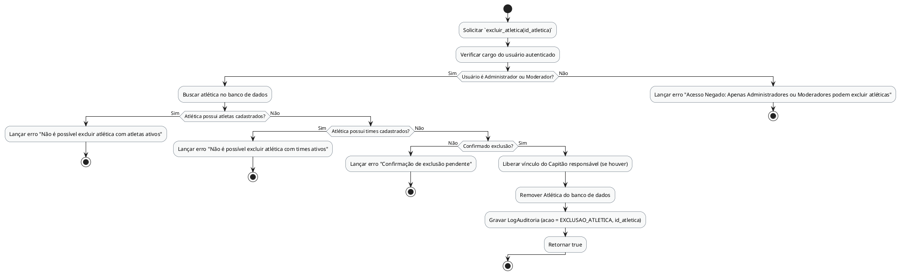

# Método `excluir_atletica()`

Este documento apresenta a explicação e o diagrama de atividades para o método `excluir_atletica()` da classe `Atlética`.

## Descrição
Exclui uma atlética do sistema. Só é permitida se não houver atletas nem times vinculados à atlética, e exige confirmação prévia. Libera o vínculo do Capitão responsável.

- **Classe:** `Atlética`
- **Requisitos Vinculados:** [RF007](file:///home/ian/Faculdade/APS/engenharia-de-requisitos/requisitos_SGDU.md#L103), [RNF005](file:///home/ian/Faculdade/APS/engenharia-de-requisitos/requisitos_SGDU.md#L165), [RNF020](file:///home/ian/Faculdade/APS/engenharia-de-requisitos/requisitos_SGDU.md#L209)
- **Atores Relacionados:** Administrador, Moderador, Capitão

## Assinatura do Método
```python
excluir_atletica() -> Boolean
```

## Regras de Negócio e Fluxo Lógico
O fluxo e as validações descritas a seguir representam o comportamento interno da operação:

1. Solicitar `excluir_atletica(id_atletica)`
2. Verificar cargo do usuário autenticado
3. Buscar atlética no banco de dados
4. Lançar erro "Não é possível excluir atlética com atletas ativos"
5. Lançar erro "Não é possível excluir atlética com times ativos"
6. Lançar erro "Confirmação de exclusão pendente"
7. Liberar vínculo do Capitão responsável (se houver)
8. Remover Atlética do banco de dados
9. Gravar LogAuditoria (acao = EXCLUSAO_ATLETICA, id_atletica)
10. Retornar true
11. Lançar erro "Acesso Negado: Apenas Administradores ou Moderadores podem excluir atléticas"

## Diagrama de Atividades
O diagrama abaixo detalha visualmente o fluxo de decisões, desvios e ações executados pelo método. Ele foi modelado utilizando o formato PlantUML.



## Links Relacionados
- **Arquivo de Diagrama:** [excluir_atletica.puml](excluir_atletica.puml)
- **Documento Principal de Visão Lógica:** [Visão Lógica (visao_logica.md)](file:///home/ian/Faculdade/APS/engenharia-de-requisitos/docs/visao_logica/visao_logica.md)
