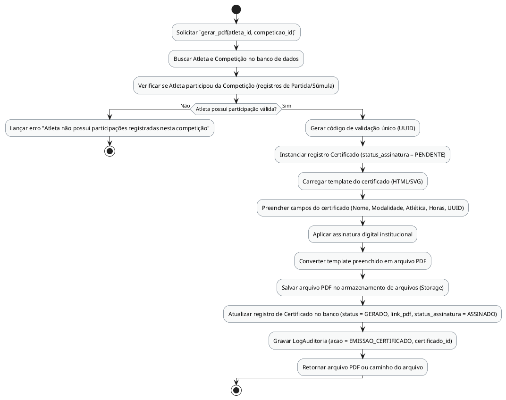

# Método `gerar_pdf()`

Este documento apresenta a explicação e o diagrama de atividades para o método `gerar_pdf()` da classe `Certificado`.

## Descrição
Gera um certificado digital em formato PDF para o atleta participante de uma competição, contendo código UUID exclusivo para validação e aplicando assinatura digital institucional.

- **Classe:** `Certificado`
- **Requisitos Vinculados:** [RF026](file:///home/ian/Faculdade/APS/engenharia-de-requisitos/requisitos_SGDU.md#L141)
- **Atores Relacionados:** Administrador, Moderador, Capitão

## Assinatura do Método
```python
gerar_pdf()
```

## Regras de Negócio e Fluxo Lógico
O fluxo e as validações descritas a seguir representam o comportamento interno da operação:

1. Solicitar `gerar_pdf(atleta_id, competicao_id)`
2. Buscar Atleta e Competição no banco de dados
3. Verificar se Atleta participou da Competição (registros de Partida/Súmula)
4. Lançar erro "Atleta não possui participações registradas nesta competição"
5. Gerar código de validação único (UUID)
6. Instanciar registro Certificado (status_assinatura = PENDENTE)
7. Carregar template do certificado (HTML/SVG)
8. Preencher campos do certificado (Nome, Modalidade, Atlética, Horas, UUID)
9. Aplicar assinatura digital institucional
10. Converter template preenchido em arquivo PDF
11. Salvar arquivo PDF no armazenamento de arquivos (Storage)
12. Atualizar registro de Certificado no banco (status = GERADO, link_pdf, status_assinatura = ASSINADO)
13. Gravar LogAuditoria (acao = EMISSAO_CERTIFICADO, certificado_id)
14. Retornar arquivo PDF ou caminho do arquivo

## Diagrama de Atividades
O diagrama abaixo detalha visualmente o fluxo de decisões, desvios e ações executados pelo método. Ele foi modelado utilizando o formato PlantUML.



## Links Relacionados
- **Arquivo de Diagrama:** [gerar_pdf.puml](gerar_pdf.puml)
- **Documento Principal de Visão Lógica:** [Visão Lógica (visao_logica.md)](file:///home/ian/Faculdade/APS/engenharia-de-requisitos/docs/visao_logica/visao_logica.md)
