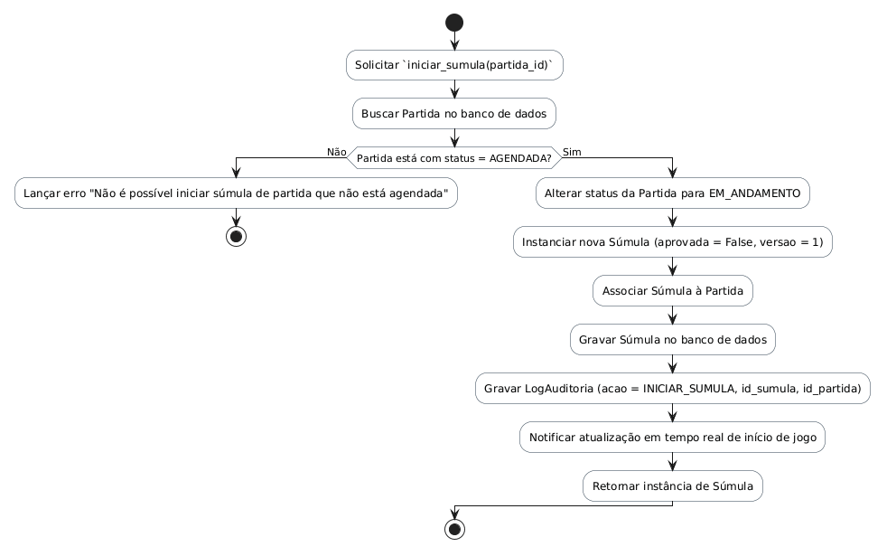

# Método `iniciar_sumula()`

Este documento apresenta a explicação e o diagrama de atividades para o método `iniciar_sumula()` da classe `Súmula`.

## Descrição
Inicia o preenchimento digital da súmula de uma partida. Altera o status da partida para EM_ANDAMENTO e inicializa a súmula com resultado detalhado vazio e pendente de aprovação.

- **Classe:** `Súmula`
- **Requisitos Vinculados:** [RF020](file:///home/ian/Faculdade/APS/engenharia-de-requisitos/requisitos_SGDU.md#L129)
- **Atores Relacionados:** Administrador, Moderador, Capitão

## Assinatura do Método
```python
iniciar_sumula()
```

## Regras de Negócio e Fluxo Lógico
O fluxo e as validações descritas a seguir representam o comportamento interno da operação:

1. Solicitar `iniciar_sumula(partida_id)`
2. Buscar Partida no banco de dados
3. Lançar erro "Não é possível iniciar súmula de partida que não está agendada"
4. Alterar status da Partida para EM_ANDAMENTO
5. Instanciar nova Súmula (aprovada = False, versao = 1)
6. Associar Súmula à Partida
7. Gravar Súmula no banco de dados
8. Gravar LogAuditoria (acao = INICIAR_SUMULA, id_sumula, id_partida)
9. Notificar atualização em tempo real de início de jogo
10. Retornar instância de Súmula

## Diagrama de Atividades
O diagrama abaixo detalha visualmente o fluxo de decisões, desvios e ações executados pelo método. Ele foi modelado utilizando o formato PlantUML.



## Links Relacionados
- **Arquivo de Diagrama:** [iniciar_sumula.puml](iniciar_sumula.puml)
- **Documento Principal de Visão Lógica:** [Visão Lógica (visao_logica.md)](file:///home/ian/Faculdade/APS/engenharia-de-requisitos/docs/visao_logica/visao_logica.md)
