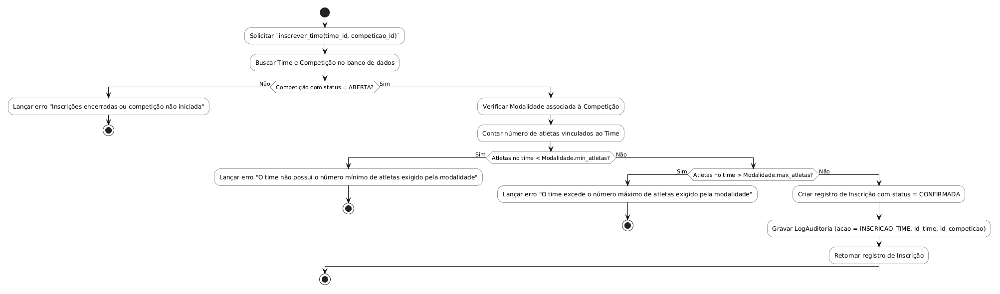

# Método `inscrever_time()`

Este documento apresenta a explicação e o diagrama de atividades para o método `inscrever_time()` da classe `Inscrição`.

## Descrição
Inscreve um time em uma competição. Valida se a competição está com inscrições abertas e se o time possui o número mínimo e máximo de atletas exigido pela modalidade esportiva.

- **Classe:** `Inscrição`
- **Requisitos Vinculados:** [RF011](file:///home/ian/Faculdade/APS/engenharia-de-requisitos/requisitos_SGDU.md#L111), [RF019](file:///home/ian/Faculdade/APS/engenharia-de-requisitos/requisitos_SGDU.md#L127)
- **Atores Relacionados:** Administrador, Moderador, Capitão

## Assinatura do Método
```python
inscrever_time() -> Inscrição
```

## Regras de Negócio e Fluxo Lógico
O fluxo e as validações descritas a seguir representam o comportamento interno da operação:

1. Solicitar `inscrever_time(time_id, competicao_id)`
2. Buscar Time e Competição no banco de dados
3. Lançar erro "Inscrições encerradas ou competição não iniciada"
4. Verificar Modalidade associada à Competição
5. Contar número de atletas vinculados ao Time
6. Lançar erro "O time não possui o número mínimo de atletas exigido pela modalidade"
7. Lançar erro "O time excede o número máximo de atletas exigido pela modalidade"
8. Criar registro de Inscrição com status = CONFIRMADA
9. Gravar LogAuditoria (acao = INSCRICAO_TIME, id_time, id_competicao)
10. Retornar registro de Inscrição

## Diagrama de Atividades
O diagrama abaixo detalha visualmente o fluxo de decisões, desvios e ações executados pelo método. Ele foi modelado utilizando o formato PlantUML.



## Links Relacionados
- **Arquivo de Diagrama:** [inscrever_time.puml](inscrever_time.puml)
- **Documento Principal de Visão Lógica:** [Visão Lógica (visao_logica.md)](file:///home/ian/Faculdade/APS/engenharia-de-requisitos/docs/visao_logica/visao_logica.md)
