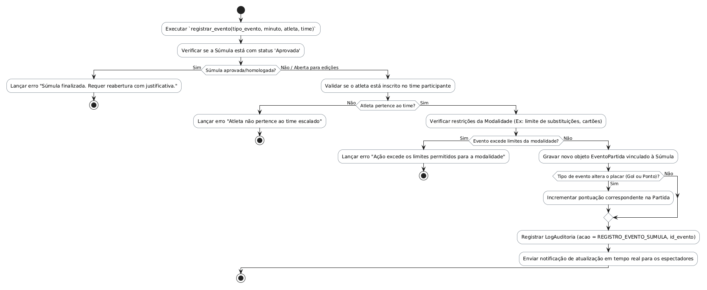

# Método `registrar_evento()`

Este documento apresenta a explicação e o diagrama de atividades para o método `registrar_evento()` da classe `Súmula`.

## Descrição
Registra um evento dinâmico da partida (gol, ponto, cartões, etc.) em tempo real. Valida se a súmula não está finalizada, se o atleta pertence ao time escalado e se as restrições da modalidade são atendidas.

- **Classe:** `Súmula`
- **Requisitos Vinculados:** [RF020](file:///home/ian/Faculdade/APS/engenharia-de-requisitos/requisitos_SGDU.md#L129)
- **Atores Relacionados:** Administrador, Moderador, Capitão

## Assinatura do Método
```python
registrar_evento(evento: EventoPartida)
```

## Regras de Negócio e Fluxo Lógico
O fluxo e as validações descritas a seguir representam o comportamento interno da operação:

1. Executar `registrar_evento(tipo_evento, minuto, atleta, time)`
2. Verificar se a Súmula está com status 'Aprovada'
3. Lançar erro "Súmula finalizada. Requer reabertura com justificativa."
4. Validar se o atleta está inscrito no time participante
5. Lançar erro "Atleta não pertence ao time escalado"
6. Verificar restrições da Modalidade (Ex: limite de substituições, cartões)
7. Lançar erro "Ação excede os limites permitidos para a modalidade"
8. Gravar novo objeto EventoPartida vinculado à Súmula
9. Incrementar pontuação correspondente na Partida
10. Registrar LogAuditoria (acao = REGISTRO_EVENTO_SUMULA, id_evento)
11. Enviar notificação de atualização em tempo real para os espectadores

## Diagrama de Atividades
O diagrama abaixo detalha visualmente o fluxo de decisões, desvios e ações executados pelo método. Ele foi modelado utilizando o formato PlantUML.



## Links Relacionados
- **Arquivo de Diagrama:** [registrar_evento.puml](registrar_evento.puml)
- **Documento Principal de Visão Lógica:** [Visão Lógica (visao_logica.md)](file:///home/ian/Faculdade/APS/engenharia-de-requisitos/docs/visao_logica/visao_logica.md)
