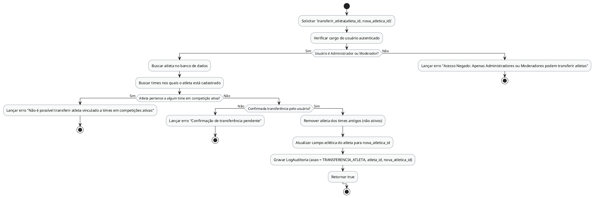

# Método `transferir_atleta()`

Este documento apresenta a explicação e o diagrama de atividades para o método `transferir_atleta()` da classe `Atleta`.

## Descrição
Transfere um atleta de atlética. Só é permitida para Administrador ou Moderador, e somente se o atleta não estiver vinculado a times participando de competições ativas.

- **Classe:** `Atleta`
- **Requisitos Vinculados:** [RF010](file:///home/ian/Faculdade/APS/engenharia-de-requisitos/requisitos_SGDU.md#L109), [RNF005](file:///home/ian/Faculdade/APS/engenharia-de-requisitos/requisitos_SGDU.md#L165)
- **Atores Relacionados:** Administrador, Moderador, Capitão

## Assinatura do Método
```python
transferir_atleta(nova_atletica: Atlética) -> Boolean
```

## Regras de Negócio e Fluxo Lógico
O fluxo e as validações descritas a seguir representam o comportamento interno da operação:

1. Solicitar `transferir_atleta(atleta_id, nova_atletica_id)`
2. Verificar cargo do usuário autenticado
3. Buscar atleta no banco de dados
4. Buscar times nos quais o atleta está cadastrado
5. Lançar erro "Não é possível transferir atleta vinculado a times em competições ativas"
6. Lançar erro "Confirmação de transferência pendente"
7. Remover atleta dos times antigos (não ativos)
8. Atualizar campo atlética do atleta para nova_atletica_id
9. Gravar LogAuditoria (acao = TRANSFERENCIA_ATLETA, atleta_id, nova_atletica_id)
10. Retornar true
11. Lançar erro "Acesso Negado: Apenas Administradores ou Moderadores podem transferir atletas"

## Diagrama de Atividades
O diagrama abaixo detalha visualmente o fluxo de decisões, desvios e ações executados pelo método. Ele foi modelado utilizando o formato PlantUML.



## Links Relacionados
- **Arquivo de Diagrama:** [transferir_atleta.puml](transferir_atleta.puml)
- **Documento Principal de Visão Lógica:** [Visão Lógica (visao_logica.md)](file:///home/ian/Faculdade/APS/engenharia-de-requisitos/docs/visao_logica/visao_logica.md)
