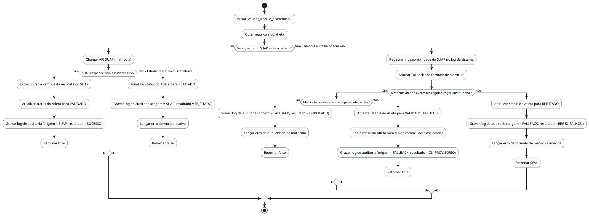

# Método `validar_vinculo_academico()`

Este documento apresenta a explicação e o diagrama de atividades para o método `validar_vinculo_academico()` da classe `Atleta`.

## Descrição
Valida o vínculo acadêmico do atleta com o IFPB através da API do SUAP. Se offline, aciona o fallback de validação do formato de matrícula via regex e enfileira para reconciliação assíncrona.

- **Classe:** `Atleta`
- **Requisitos Vinculados:** [RF028](file:///home/ian/Faculdade/APS/engenharia-de-requisitos/requisitos_SGDU.md#L145), [RNF011](file:///home/ian/Faculdade/APS/engenharia-de-requisitos/requisitos_SGDU.md#L183)
- **Atores Relacionados:** Administrador, Moderador, Capitão

## Assinatura do Método
```python
validar_vinculo_academico() -> Boolean
```

## Regras de Negócio e Fluxo Lógico
O fluxo e as validações descritas a seguir representam o comportamento interno da operação:

1. Iniciar `validar_vinculo_academico()`
2. Obter matrícula do atleta
3. Chamar API SUAP (matricula)
4. Extrair curso e campus da resposta do SUAP
5. Atualizar status do Atleta para VALIDADO
6. Gravar log de auditoria (origem = SUAP, resultado = SUCESSO)
7. Retornar true
8. Atualizar status do Atleta para REJEITADO
9. Gravar log de auditoria (origem = SUAP, resultado = REJEITADO)
10. Lançar erro de vínculo inativo
11. Retornar false
12. Registrar indisponibilidade do SUAP no log de sistema
13. Acionar Fallback por Formato de Matrícula
14. Gravar log de auditoria (origem = FALLBACK, resultado = DUPLICADO)
15. Lançar erro de duplicidade de matrícula
16. Retornar false
17. Atualizar status do Atleta para VALIDADO_FALLBACK
18. Enfileirar ID do Atleta para fila de reconciliação assíncrona
19. Gravar log de auditoria (origem = FALLBACK, resultado = OK_PROVISORIO)
20. Retornar true
21. Atualizar status do Atleta para REJEITADO
22. Gravar log de auditoria (origem = FALLBACK, resultado = REGEX_FALHOU)
23. Lançar erro de formato de matrícula inválida
24. Retornar false

## Diagrama de Atividades
O diagrama abaixo detalha visualmente o fluxo de decisões, desvios e ações executados pelo método. Ele foi modelado utilizando o formato PlantUML.



## Links Relacionados
- **Arquivo de Diagrama:** [validar_vinculo_academico.puml](validar_vinculo_academico.puml)
- **Documento Principal de Visão Lógica:** [Visão Lógica (visao_logica.md)](file:///home/ian/Faculdade/APS/engenharia-de-requisitos/docs/visao_logica/visao_logica.md)
