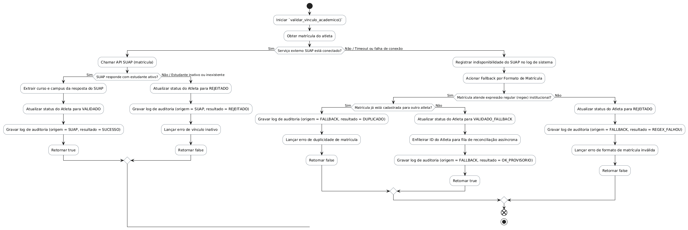
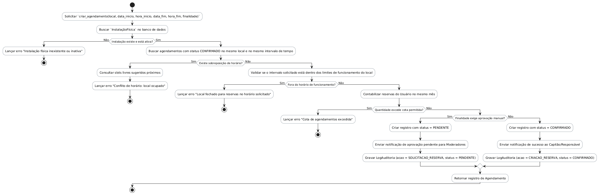
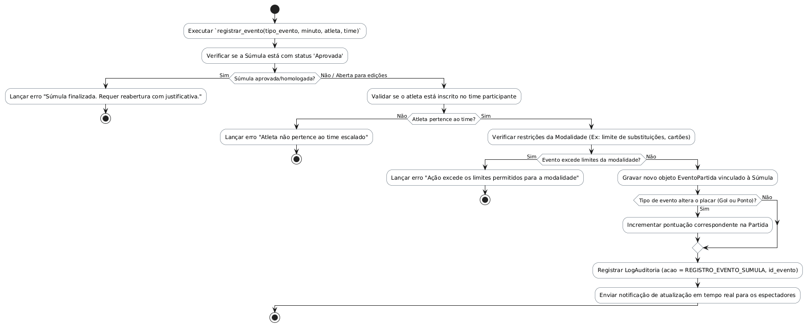
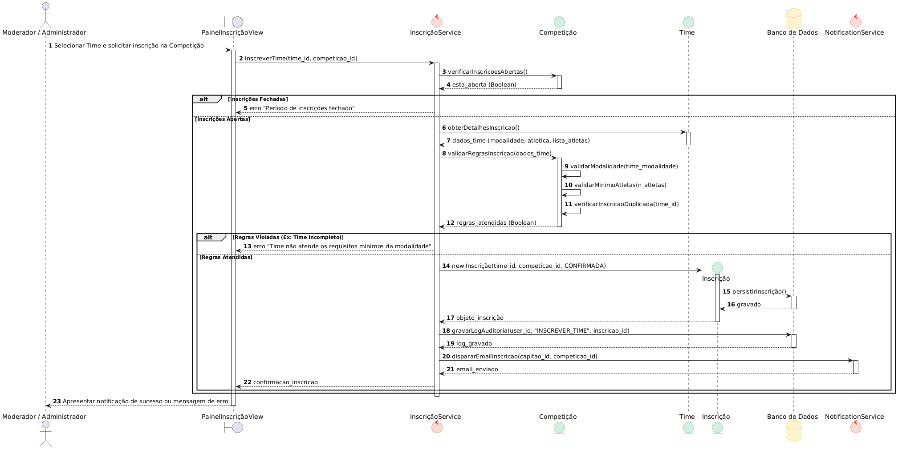

# Visão Lógica do Sistema (SGDU)

Este documento apresenta a **Visão Lógica** do **Sistema de Gerenciamento Desportivo Universitário (SGDU)**. Ele detalha a modelagem da arquitetura do sistema, aplicando as heurísticas de projeto sobre os requisitos mapeados em [requisitos_SGDU.md](file:///home/ian/Faculdade/APS/engenharia-de-requisitos/requisitos_SGDU.md) e nos Casos de Uso contidos na pasta [specs/casos_de_uso](file:///home/ian/Faculdade/APS/engenharia-de-requisitos/specs/casos_de_uso).

---

## 1. Introdução

A visão lógica exibe a estrutura do sistema e como seus componentes interagem entre si, demonstrando **como** as funcionalidades descritas nos requisitos e casos de uso são projetadas e promovidas. 

Este documento divide-se em:
* **Estrutura Estática**: Representada por um Diagrama de Classes robusto que modela o domínio do SGDU.
* **Comportamento Dinâmico**: Detalhado por meio de Diagramas de Atividades para métodos/operações chave das classes e um Diagrama de Sequência de interação de objetos para um fluxo de negócio crítico.
* **Heurísticas de Extração**: Demonstração do mapeamento de substantivos (classes/atributos) e verbos (métodos/operações) extraídos das especificações de casos de uso.

---

## 2. Heurística para Extração de Classes e Métodos

A identificação das classes e métodos é extraída de forma natural a partir das especificações de casos de uso. A seguir, demonstra-se a aplicação da heurística em casos de uso centrais do sistema.

### 2.1 Extração de Classes e Atributos (Substantivos)

Foram analisadas as especificações de [Gerenciar Atlética (UC03)](file:///home/ian/Faculdade/APS/engenharia-de-requisitos/specs/casos_de_uso/especificacao_gerenciar_atletica.md), [Gerenciar Atleta (UC04)](file:///home/ian/Faculdade/APS/engenharia-de-requisitos/specs/casos_de_uso/especificacao_gerenciar_atleta.md) e [Gerenciar Time (UC05)](file:///home/ian/Faculdade/APS/engenharia-de-requisitos/specs/casos_de_uso/especificacao_gerenciar_time.md) para extrair os substantivos candidatos.

| Substantivo | Classificação | Justificativa |
| :--- | :--- | :--- |
| **Atlética** | Classe | Entidade do domínio. Possui ações como criar, editar, listar e excluir. |
| **nome** (da atlética) | Atributo de `Atlética` | Característica identificadora da atlética. Única e obrigatória. |
| **campus** | Atributo de `Atlética` | Característica física associada à atlética. |
| **curso** | Atributo de `Atlética` | Vínculo acadêmico de representação da atlética. |
| **Atleta** | Classe | Entidade que representa os estudantes competidores no sistema. |
| **matrícula** | Atributo de `Atleta` / `Usuario` | Identificador único numérico (6 a 10 dígitos). Usado também para autenticação. |
| **nome completo** | Atributo de `Atleta` | Dado cadastral do competidor. |
| **data de nascimento** | Atributo de `Atleta` | Usado para validação de idade (14 a 100 anos). |
| **sexo** | Atributo de `Atleta` | Dado biológico para regras de categorização esportiva. |
| **vínculo acadêmico** | Atributo de `Atleta` | Estado de validação do aluno junto ao SUAP (Pendente, Validado, Fallback, etc.). |
| **Time** | Classe | Grupo de atletas que disputam modalidades específicas. |
| **nome** (do time) | Atributo de `Time` | Nome identificador do time (único por modalidade + atlética). |
| **Modalidade** | Classe / Enum | Tipo de esporte (Futsal, Vôlei, etc.) com regras de limites de atletas. |
| **Usuário** | Classe | Entidade de acesso e segurança, contendo hash de senha, e-mail e cargo. |
| **cargo** | Atributo de `Usuario` | Nível de permissão (Administrador, Moderador ou Capitão). |
| **Instalação Física** | Classe | Local físico do campus (quadra, campo, etc.) agendável. |
| **Agendamento** | Classe | Registro de reserva de uma instalação física para partidas/treinos. |
| **Súmula** | Classe | Registro oficial e digital dos eventos e placar de uma partida. |
| **Certificado** | Classe | Documento de participação digital emitido para horas complementares. |

### 2.2 Extração de Métodos e Operações (Verbos)

Para identificar os comportamentos, os verbos presentes nas especificações de caso de uso foram listados e classificados:

| Verbo Extraído | Tipo | Operação Atribuída | Classe Destino |
| :--- | :--- | :--- | :--- |
| **Criar / Cadastrar** Atlética | Operação | `criar_atletica()` | `Atlética` |
| **Editar / Atualizar** Atlética | Operação | `editar_atletica()` | `Atlética` |
| **Excluir / Remover** Atlética | Operação | `excluir_atletica()` | `Atlética` |
| **Listar / Buscar** Atlética | Operação | `listar_atleticas()` | `Atlética` |
| **Cadastrar** Atleta | Operação | `cadastrar_atleta()` | `Atleta` |
| **Transferir** Atleta | Operação | `transferir_atleta(nova_atletica)` | `Atleta` |
| **Validar vínculo** com SUAP | Operação | `validar_vinculo_academico()` | `Atleta` |
| **Autenticar** Usuário | Operação | `autenticar()` | `Usuario` |
| **Alterar** Senha | Operação | `alterar_senha(nova_senha)` | `Usuario` |
| **Inscrever** Time | Operação | `inscrever_time()` | `Inscrição` |
| **Registrar / Iniciar** Súmula | Operação | `iniciar_sumula()` / `registrar_evento()` | `Súmula` |
| **Agendar** Instalação | Operação | `criar_agendamento()` | `Agendamento` |
| **Emitir** Certificado | Operação | `gerar_pdf()` / `enviar_por_email()` | `Certificado` |
| *Preencher formulário* | Descartar | - (Ação de interface/UI) | - |
| *Confirmar exclusão* | Redundante | - (Validado na própria exclusão) | - |
| *Verificar se cadastrou* | Redundante | - (Retorno booleano/exceção) | - |

---

## 3. Modelo de Estrutura Estática: Diagrama de Classes

Abaixo está o diagrama de classes completo do SGDU, modelado com tipagem adequada para persistência em PostgreSQL e backend Django (Python 3.8+), conforme os requisitos técnicos [RNF017](file:///home/ian/Faculdade/APS/engenharia-de-requisitos/requisitos_SGDU.md#L200) e segurança RBAC [RNF005](file:///home/ian/Faculdade/APS/engenharia-de-requisitos/requisitos_SGDU.md#L165).

* **Código-fonte PlantUML**: [diagrama-classes.puml](diagrama-classes.puml)

---

## 4. Modelo de Comportamento Dinâmico: Diagramas de Atividades

> [!NOTE]
> Na Visão Lógica, o Diagrama de Atividades é utilizado sob o ponto de vista do desenvolvedor, detalhando o fluxo lógico interno e as regras de negócio de uma operação ou método de classe específico.

### 4.1 Validação de Vínculo Acadêmico (`Atleta.validar_vinculo_academico()`)
Este fluxo reflete os requisitos do [UC17 (Validar Vínculo Acadêmico)](file:///home/ian/Faculdade/APS/engenharia-de-requisitos/specs/casos_de_uso/especificacao_validar_vinculo_academico.md) e [RF028](file:///home/ian/Faculdade/APS/engenharia-de-requisitos/requisitos_SGDU.md#L145), implementando a integração com o SUAP e o fallback local via formato de matrícula.

* **Código-fonte PlantUML**: [diagrama-atividades.puml](diagrama-atividades.puml)

### 4.2 Criação de Reserva (`Agendamento.criar_agendamento()`)
Este fluxo detalha as validações de disponibilidade física e conflitos de horário exigidas no [UC13 (Agendar Instalação Física)](file:///home/ian/Faculdade/APS/engenharia-de-requisitos/specs/casos_de_uso/especificacao_agendar_instalacao_fisica.md) e [RF023](file:///home/ian/Faculdade/APS/engenharia-de-requisitos/requisitos_SGDU.md#L135).

* **Código-fonte PlantUML**: [fluxo-UC13.puml](fluxo-UC13.puml)

### 4.3 Registro de Evento em Partida (`Súmula.registrar_evento()`)
Este fluxo apresenta o registro dinâmico de eventos (gols, pontos, cartões) durante uma partida em tempo real, conforme [UC10 (Registrar Súmula)](file:///home/ian/Faculdade/APS/engenharia-de-requisitos/specs/casos_de_uso/especificacao_registrar_sumula.md) e [RF020](file:///home/ian/Faculdade/APS/engenharia-de-requisitos/requisitos_SGDU.md#L129).

* **Código-fonte PlantUML**: [fluxo-UC10.puml](fluxo-UC10.puml)

---

## 5. Diagrama de Sequência de Objeto

O diagrama a seguir detalha o fluxo de interação e mensagens entre os objetos para a realização da inscrição de um time em uma competição, implementando o caso de uso [UC09 (Inscrever Time em Competição)](file:///home/ian/Faculdade/APS/engenharia-de-requisitos/specs/casos_de_uso/especificacao_inscrever_time_em_competicao.md) e o requisito [RF019](file:///home/ian/Faculdade/APS/engenharia-de-requisitos/requisitos_SGDU.md#L127).

* **Código-fonte PlantUML**: [diagrama-sequencia-objetos.puml](diagrama-sequencia-objetos.puml)

---

## 6. Considerações Finais e Auditoria

A Visão Lógica apresentada assegura:
1. **Rastreabilidade completa**: Todas as regras e validações estabelecidas na [especificação de requisitos](file:///home/ian/Faculdade/APS/engenharia-de-requisitos/requisitos_SGDU.md) foram refletidas nos atributos e métodos das classes.
2. **Segurança (RBAC e Logs)**: As classes `Usuario` e `LogAuditoria` asseguram que cada operação de alteração de estado no banco seja devidamente autorizada e rastreada.
3. **Robustez na Integração**: Os fluxos dinâmicos preveem contingências de rede (como o fallback de validação do SUAP), tornando o SGDU resiliente a falhas de infraestrutura.
