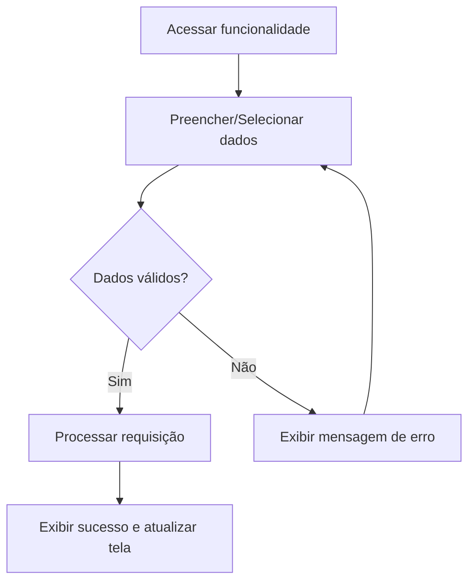

# Especificação de Caso de Uso: Emitir Certificado

## 1. Identificação
- **Identificador**: UC15
- **Nome do Caso de Uso**: Emitir Certificado
- **Atores Principais**: Administrador
- **Requisitos Funcionais Associados**: RF026

## 2. Descrição
Gera e gerencia os certificados de participação para os atletas, visando horas complementares.

## 3. Pré-condições
- O usuário deve estar autenticado no sistema (exceto para usuários públicos, onde aplicável).
- O usuário deve possuir as permissões adequadas de acordo com seu cargo (Administrador, Moderador ou Capitão).
- O atleta ter participado ativamente do evento.

## 4. Fluxo Principal
1. O ator acessa o menu principal e seleciona a funcionalidade: Emissão de Certificado.
2. O sistema exibe a interface correspondente para interação (botão de emitir certificados).
3. O ator aciona o botão de confirmação.
4. O sistema envia o certificado para o email acadêmico de cada participante validado.

## 5. Pós-condições
O estado do sistema reflete a operação realizada de forma persistente, preservando a integridade referencial dos dados entre atléticas, times, competições e atletas.

---

### Diagrama de Atividades Opcional (Mermaid)

