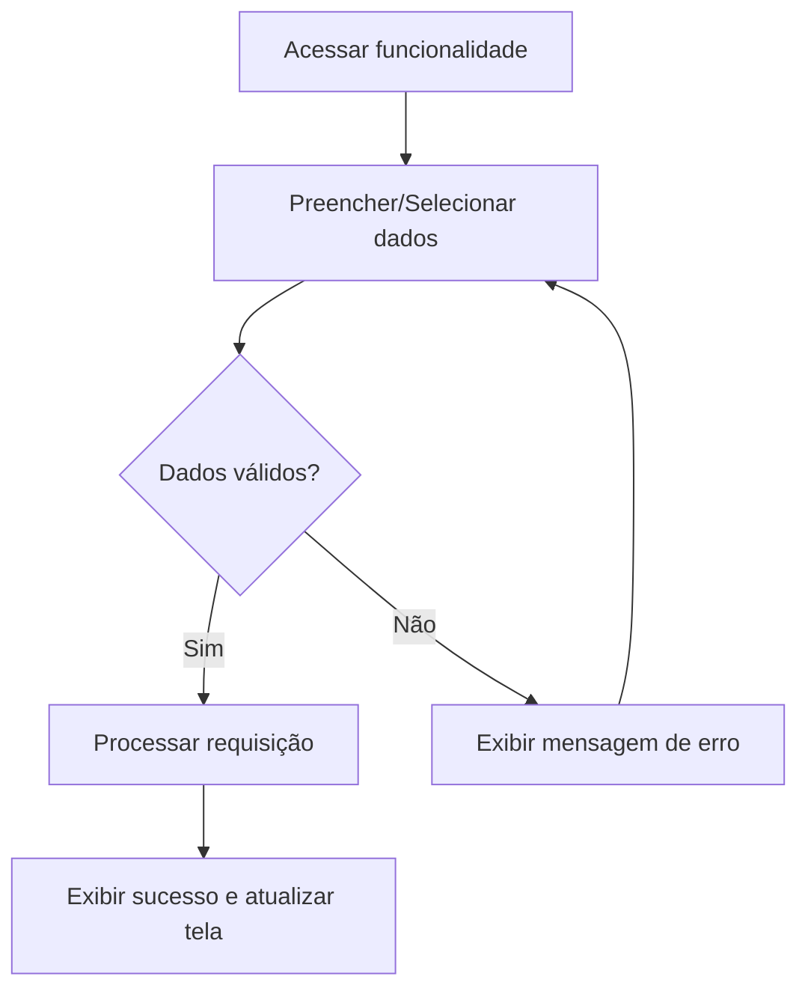

# Especificação de Caso de Uso: Gerenciar Atlética

## 1. Identificação
- **Identificador**: UC03
- **Nome do Caso de Uso**: Gerenciar Atlética
- **Atores Principais**: Administrador, Moderador, Capitão
- **Requisitos Funcionais Associados**: RF004, RF005, RF006, RF007

## 2. Descrição
Permite o cadastro, edição, listagem e exclusão de atléticas no sistema.

## 3. Pré-condições
- O usuário deve estar autenticado no sistema (exceto para usuários públicos, onde aplicável).
- O usuário deve possuir as permissões adequadas de acordo com seu cargo (Administrador, Moderador ou Capitão).

## 4. Fluxo Principal
1. O ator acessa o menu principal e seleciona a funcionalidade Gerenciar Atlética.
2. O sistema exibe a interface correspondente para interação (Painel/Formulário).
3. O ator insere os dados pertinentes à operação: nome da atlética (único no sistema, entre 3 e 255 caracteres), campus e curso.
4. O ator aciona o botão de confirmação.
5. O sistema valida as regras de negócio e os dados informados.
6. O sistema processa a operação e atualiza o banco de dados.
7. O sistema exibe uma notificação de sucesso e atualiza o sistema com as novas informações.

## 5. Fluxos Alternativos e de Exceção
editar, excluir, visualizar, atribuir capitão
- **[FA01] Editar Dados**:
  - O ator pode editar os dados pertinentes à operação: nome da atlética (único no sistema, entre 3 e 255 caracteres), campus e curso.
- **[FA02] Excluir Dados**:
  - O ator pode excluir os dados pertinentes à operação: nome da atlética (único no sistema, entre 3 e 255 caracteres), campus e curso.
- **[FA03] Atribuir Capitão**:
  - O ator pode atribuir um capitão como responsável da atlética criada.
- **[FA04] Visualizar Atlética**:
  - O Administrador e o Moderador visualizam todas as atléticas; o Capitão visualiza apenas a sua própria. As informações exibidas devem incluir: nome, campus, capitão responsável, número de atletas e número de times, além das ações disponíveis conforme o cargo.
- **[FA05] Dados Inválidos ou Incompletos**:
  - Se, no passo 5, o sistema detectar que faltam dados obrigatórios ou que regras de negócio foram violadas (ex: matrícula repetida, time abaixo do limite, etc.), o sistema interrompe a operação e exibe uma mensagem de erro indicando o campo a ser corrigido.
- **[FA06] Permissão Negada**:
  - Caso o ator tente modificar registros aos quais não possui escopo (ex: Capitão tentando alterar atleta de outra atlética), o sistema bloqueia a ação, retorna um erro de acesso negado e registra a tentativa em log.
- **[FA07] Dependências Ativas (Exclusão)**:
  - Se o ator tentar excluir uma atlética com times ativos ou um time já inscrito em competições, o sistema exibe uma mensagem de alerta e cancela a exclusão, exigindo que as dependências sejam desfeitas primeiro.

## 6. Pós-condições
O estado do sistema reflete a operação realizada de forma persistente, preservando a integridade referencial dos dados entre atléticas, times, competições e atletas.

---

### Diagrama de Atividades Opcional (Mermaid)

