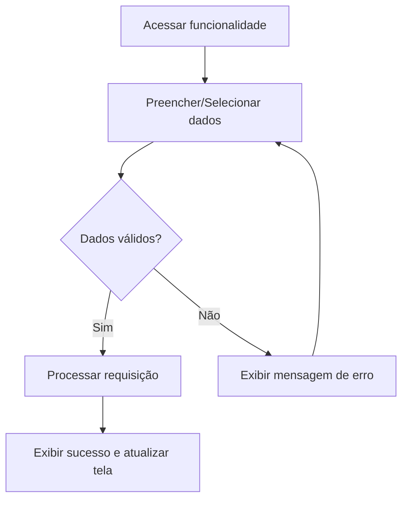

# Especificação de Caso de Uso: Gerenciar Cargo Administrativo

## 1. Identificação
- **Identificador**: UC06
- **Nome do Caso de Uso**: Gerenciar Cargo Administrativo
- **Atores Principais**: Administrador, Moderador
- **Requisitos Funcionais Associados**: RF015, RF016

## 2. Descrição
Permite atribuir e remover cargos de Capitão e Moderador aos atletas já cadastrados.

## 3. Pré-condições
- O usuário deve estar autenticado no sistema (exceto para usuários públicos, onde aplicável).
- O usuário deve possuir as permissões adequadas de acordo com seu cargo (Administrador, Moderador ou Capitão).

## 4. Fluxo Principal
1. O ator acessa o menu principal e seleciona a funcionalidade Gerenciar Cargo.
2. O sistema exibe a interface correspondente para interação (formulário/painel).
3. O ator atribui o cargo ao usuário desejado seguindo as regras de hierarquia: Capitão (atribuível por Administrador e Moderador, exige vinculação a uma atlética sem capitão) e Moderador (atribuível apenas por Administrador).
4. O ator aciona o botão de confirmação.
5. O sistema valida as regras de negócio e os dados informados.
6. O sistema processa a operação e atualiza o banco de dados.
7. O sistema exibe uma notificação de sucesso e atualiza o sistema com as novas informações.

## 5. Fluxos Alternativos e de Exceção
- **[FA01] Excluir Cargo**:
  - O ator pode excluir o cargo atribuído ao usuário.

## 6. Pós-condições
O estado do sistema reflete a operação realizada de forma persistente, preservando a integridade referencial dos dados entre atléticas, times, competições e atletas.

---

### Diagrama de Atividades Opcional (Mermaid)

